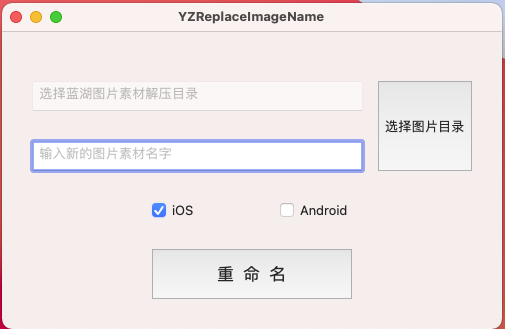
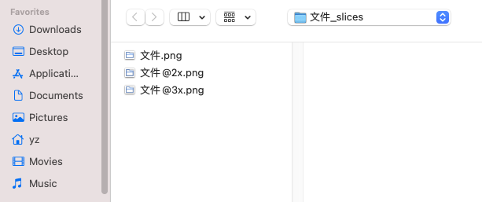
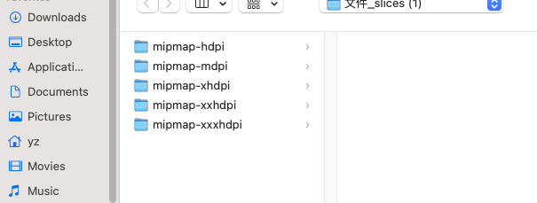
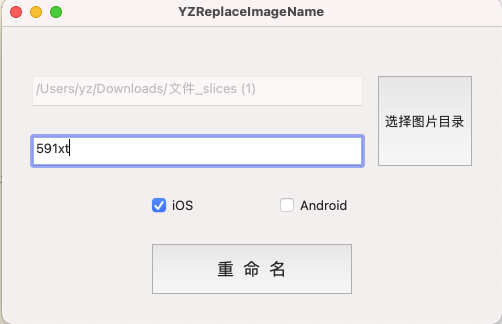

# YZReplaceImageName

MAC端批量修改蓝湖素材图片名字

蓝湖的素材一般都是由素材剪辑好的

但是由于素材的命名可能不太符合程序猿的命名规则

但是手动改的话可能比较慢

因为一张素材会分几个版本

所以专门花了几十分钟专门针对蓝湖的图片素材做了一个重命名的 `MAC` 软件

支持重从蓝湖上下载的 `Android` 和 `iOS` 的图片

功能很简单

选择素材所在的文件夹

然后输入新名字

点击重命名就行了

